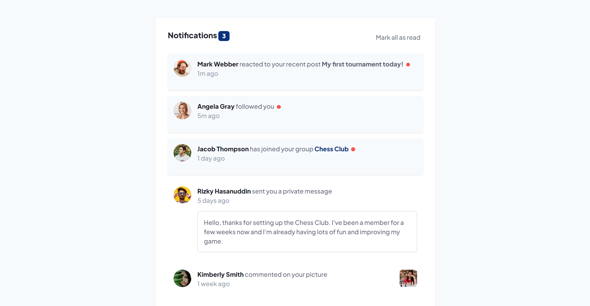

# Frontend Mentor - Notifications page solution

This is a solution to the [Notifications page challenge on Frontend Mentor](https://www.frontendmentor.io/challenges/notifications-page-DqK5QAmKbC). Frontend Mentor challenges help you improve your coding skills by building realistic projects.

## Table of contents

-   [Overview](#overview)
    -   [The challenge](#the-challenge)
    -   [Screenshot](#screenshot)
    -   [Links](#links)
-   [My process](#my-process)
    -   [Built with](#built-with)
    -   [What I learned](#what-i-learned)
    -   [Continued development](#continued-development)
    <!-- -   [Useful resources](#useful-resources) -->
-   [Author](#author)
-   [Acknowledgments](#acknowledgments)

**Note: Delete this note and update the table of contents based on what sections you keep.**

## Overview

### The challenge

Users should be able to:

-   Distinguish between "unread" and "read" notifications
-   Select "Mark all as read" to toggle the visual state of the unread notifications and set the number of unread messages to zero
-   View the optimal layout for the interface depending on their device's screen size
-   See hover and focus states for all interactive elements on the page

### Screenshot



**Note: Delete this note and the paragraphs above when you add your screenshot. If you prefer not to add a screenshot, feel free to remove this entire section.**

### Links

-   Solution URL: [Notifications Page using Bootstrap](https://github.com/PaingMinSoe/notifications-page-using-bootstrap)
-   Live Site URL: [Notifications Page using Bootstrap](https://your-live-site-url.com)

## My process

Firstly, I laid out the Semantic HTML for the solution. Then I try to implement Bootstrap Framework and customize it as needed. Using SCSS,
I was able to align Bootstrap to as needed for the solution. There has been a hassle tweaking the size and height for the images and divs.
I tried my best to match the solution as much as the design. After tweaking Bootstrap, I added my own custom CSS for styling of notifications, unread messages and so on.

### Built with

-   Semantic HTML5 markup
-   CSS custom properties
-   Flexbox
-   CSS Grid
-   [Bootstrap](https://getbootstrap.com/) - Bootstrap Framework

**Note: These are just examples. Delete this note and replace the list above with your own choices**

### What I learned

Upon completing the challenge, I have learned much on how to using SCSS and its capabilities and efficiency for CSS styling. I have learnt
how to use Bootstrap and its grid system and other components. I have also used a bit of JavaScript's DOM Manipulation for mark all as read
function. Using SCSS, I have learnt to tweak the Bootstrap Framework and how it can assist in effectively use frameowk to customize own
front-end development.

Here's some code snippet from my solution.

```html
<div class="d-flex notification unread shadow shadow-sm">
    
    <div class="ms-3">
        <p>
            <span class="name">Mark Webber</span> reacted to your recent post
            <span class="post">My first tournament today!</span>
            <span class="red-dot ms-1"></span>
            <br />
            <span class="time">1m ago</span>
        </p>
    </div>
</div>
```

```css
.red-dot {
    display: inline-block;
    background: $red;
    border-radius: 50%;
    width: 10px;
    height: 10px;
}
```

```js
var notification = document.querySelectorAll(".notification");

[].forEach.call(notification, function (el) {
    el.classList.remove("unread");
    el.classList.remove("shadow");
    el.classList.remove("shadow-sm");
});
```

**Note: Delete this note and the content within this section and replace with your own learnings.**

### Continued development

Currently, the mobile view for the solution is not quite similar to the one given in the designs. I would try to improve this to get as
close as possible to the given design to make the page more responsive.

**Note: Delete this note and the content within this section and replace with your own plans for continued development.**

<!-- ### Useful resources

-   [Bootstrap](https://www.getbootstrap.com) - This helped me for XYZ reason. I really liked this pattern and will use it going forward.
-   [Example resource 2](https://www.example.com) - This is an amazing article which helped me finally understand XYZ. I'd recommend it to anyone still learning this concept. -->

**Note: Delete this note and replace the list above with resources that helped you during the challenge. These could come in handy for anyone viewing your solution or for yourself when you look back on this project in the future.**

## Author

-   Facebook - [Paing Min Soe](https://www.facebook.com/scrooge.ebenezer.121/)
-   Frontend Mentor - [@PaingMinSoe](https://www.frontendmentor.io/profile/PaingMinSoe)
-   Twitter - [@paingminsoe224](https://twitter.com/paingminsoe224)

**Note: Delete this note and add/remove/edit lines above based on what links you'd like to share.**

## Acknowledgments

I got a huge help reading through documentation of Bootstrap and SCSS.

**Note: Delete this note and edit this section's content as necessary. If you completed this challenge by yourself, feel free to delete this section entirely.**
"# notifications-page-using-bootstrap" 
